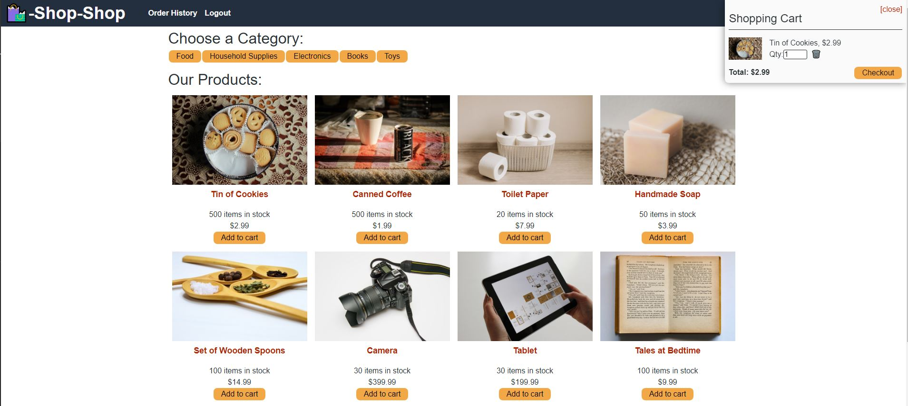

# Redux-Store

</img>

## Description

An e-commerce platform utilising Redux to manage the global state.

## LANGUAGES : Javascript, HTML, CSS

## TOOLS : Node.js, Express, React, Redux, Stripe, Appollo Server, Graphql, MongoDB, Mongoose, DotEnv, Heroku

## REPOSITORY LINK

https://github.com/ViennaBorowska/Redux-Store

## DEPLOYED APP

This application has also been deployed to Heroku [here](https://safe-bayou-40613.herokuapp.com/)

## FILES

- client > all source files, service worker js and application pages
- server > routes and server connection file
- package-lock.json - node modules tree visiblity
- package.json - node.js metadata
- README.md - project information (this document!)

## Table of Contents

- [Installation](#installation)
- [Usage](#usage)
- [License](#license)
- [Contributing](#contributing)
- [Questions](#questions)

## Installation

Clone the GitHub Repositoty and run
`npm install`
to add the required packages and dependencies.

## Usage

Once installation is complete, run
`npm run build`
to create the optimzed production build.
Then run `npm start` to launch the app.

To run the app in development mode, run
`npm run develop`.
This command automatically starts the server and launches the app.

You are then able to log in or sign up to the Shop-Shop. Users can view, add and remove items from the card, and checkout using Stripe.

## License

This project is licensed under MIT

## Contributing

Contributions and improvements are always welcome. Please clone/fork the repo. Any suggestions or feedback, please do get in touch.

## Questions

If you have any questions about this projects, please contact me directly via the channels below:  
Email: viennabdev@gmail.com. 
You can view more of my projects at https://github.com/ViennaBorowska.
